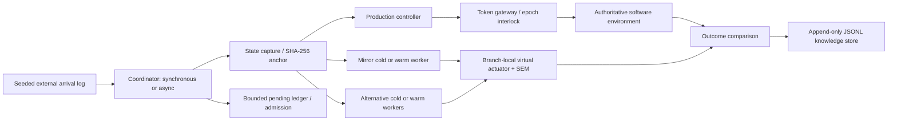

# Implemented architecture

The coordinator owns the only authoritative world object, mutation capability,
issuer secret and production token. Its branch scheduler creates immutable branch
identities. Every worker receives an anchor, explicit configuration, an assigned
action and the same ordered batch of exogenous events. It receives no parent
object reference or production token. Cold workers use a fresh process; warm
workers must rehydrate and reset before reuse. Remote execution uses that same
serialized contract and worker module.

| Responsibility | Actual implementation |
|---|---|
| State capture | `csc/contracts.py`: schema validation, canonical JSON, immutable bytes, SHA-256 |
| Input gateway/world workload | `csc/world.py`: seeded external arrivals, explicit sequence/epoch |
| Production world | Independent `ProductionWorld` transition, variable discharge and EW blocking |
| Shadow world | Independent `ShadowWorldModel` fluid transition; fixed discharge, optional incident knowledge |
| Scheduling | `csc/branches.py`: fixed, queue and simple predictive policies; distinct alternatives; mirror-first slot budget |
| Branch lifecycle | Selectable cold fresh subprocess or warm reusable process; anchor hydration, input/RNG reset, validation, recycle/destruction, cleanup |
| Async coordination | Bounded pending ledger, mirror-first admission, expiry, duplicate handling, ordered comparison finalization; synchronous mode remains selectable |
| Synchronization | `csc/sync.py`: ordering/deduplication, missing/duplicate/reorder counters, consumed sequence and payload hash |
| Actuation | `csc/safety.py`: HMAC-bound identity/action/expiry, owner check, lock-protected one-plan epoch interlock |
| Comparison | `csc/compare.py`: common anchor/window/input hash, provenance checks, utility, current-gap discounting, fallback EWMA |
| Knowledge store | `csc/store.py`: unique run directories, flushed append-only JSONL, atomically replaced manifest/summary |
| Instrumentation | `csc/runner.py`: wall time, process CPU, Python allocation peak, transport payload sizes; Linux worker RSS |
| Remote service | `csc/service.py`: HTTP, four concurrent slots, 2 MiB body bound, subprocess timeout, health/metrics endpoints |
| Evaluation | `experiments/`: paired sweeps, artifact replay, failure/fidelity runs, Markdown report generation |

State capture happens between test-world ticks in a single coordinator thread;
there are no concurrent writers requiring a distributed snapshot protocol.
Branch inputs are batches of exogenous events, not snapshots of post-action
production queues. The environment and SEM close their loops independently.

An epoch authorizes **one complete plan**. NS/EW plans hold a direction, while
BALANCED has an internal phase change. The gateway does not accept a new external
actuation each tick. This resolves the specification's conflict between a
one-actuation-per-epoch interlock and per-tick actuation pseudocode.

Production actuation is issued before shadow dispatch. In synchronous mode the
local harness retains a bounded comparison barrier. In selectable async mode the
coordinator advances production without awaiting shadow completion, while a
bounded ledger finalizes, expires, or drops speculative work in epoch order.
Warm workers rehydrate from each assigned anchor and reset per-assignment inputs
and RNG before execution; cold workers retain fresh-process behavior. Async
logical decoupling does not make coordinator storage, polling, host scheduling,
CPU, memory, or I/O non-interfering. No claim of hard real-time production
independence is made.

The synchronization metric is duration of local validation/delivery, including an
injected delay. HTTP/process dispatch roundtrip is measured separately. These are
not distributed clock-skew measurements. Payload bytes are serialized request and
response sizes, not packet-level network bandwidth. CPU-ms covers measured model
work and coordinator work; worker process startup CPU is not included. Windows
worker RSS is unavailable in the initial implementation and is recorded as null.

There is no external database or message bus. No branch credentials are needed for
Redis/NATS, because those components do not exist here. HTTP workers reply only on
the inbound request; the proposed cluster policy therefore permits no worker egress.
NetworkPolicy and filesystem containment remain unverified until actual deployment.
