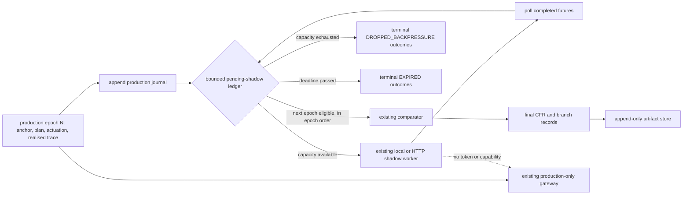

# Asynchronous production/shadow non-interference design

**Status:** Proposed (2026-09-28). No runtime implementation, deployment, or new experiment is included in this artifact.

## Question

What is the smallest change that lets the authoritative J1 production loop start epoch N+1 without waiting for shadow work from epoch N, while preserving anchor/window association, fail-closed actuation, bounded resources, and the reproducible synchronous experiment mode?

## Evidence and method

This is a code- and artifact-grounded design review. It reads the implemented paths in `csc/runner.py`, `csc/branches.py`, `csc/compare.py`, `csc/safety.py`, `csc/contracts.py`, `csc/store.py`, and `experiments/replay.py`, plus `ARCHITECTURE.md`, `research/RESEARCH_CONTEXT.md`, and `research/RESEARCH_STATUS.md`. It makes no measurement.

The present barrier is explicit: `runner.run` launches `branches[1:]`, evolves production, then calls `BranchManager.collect(futures)` before comparison, persistence, reaping, and the next epoch. `ThreadPoolExecutor(max_workers=...)` limits active workers but does not bound its submission queue. The existing actuator boundaries should remain: `execute_shadow` rejects `PRODUCTION`, shadows receive no coordinator credential or capability, and `ActuatorGateway` accepts one signed production plan for its current epoch.

The current smoke evidence therefore establishes logical trajectory independence only under a blocking harness. `research/RESEARCH_STATUS.md` correctly says wall-clock production non-interference is not established.

## Proposed architecture

Keep the coordinator, BranchManager, worker contract, gateway, JSONL store, comparator, and replay model. Add one coordinator-owned, single-threaded **pending-shadow ledger** between launch and comparison. It holds immutable epoch packages and polls futures without blocking production. It is an in-process bounded component, not a message bus, distributed scheduler, or learning path.

### Per-epoch flow

1. The production path remains in its current order: capture the immutable anchor, select a plan, open and actuate the production epoch, obtain the exogenous event window, and evolve the authoritative world.
2. Immediately append a durable `PRODUCTION_COMMITTED` journal entry containing all planned branch identities, anchor hash, window, production outcome, and a deadline derived from a monotonic clock. Anchors and events remain in their existing streams. This commits the authoritative result before a shadow completion.
3. Build existing serialized shadow requests from that package. Admit the whole shadow set only when sufficient task permits exist. Otherwise write a terminal estimated placeholder for every non-production branch with `DROPPED_BACKPRESSURE`; submit none of that epoch's shadow work. Whole-set admission makes capacity behavior deterministic and avoids a selection-dependent partial set.
4. The production loop calls non-blocking `poll(now)` at defined epoch boundaries, then advances. Poll records completed results, marks pending branches `EXPIRED` at their deadline, and calls `cancel()` only for futures that have not started. A running subprocess remains bounded by its existing worker timeout; its eventual result is late.
5. Finalize only the lowest unfinalized epoch whose every planned shadow branch is terminal. Call the existing comparator once with its saved package, production outcome, and terminal shadow outcomes. In-order finalization preserves the current comparator's epsilon-EWMA order when workers finish out of order.
6. After finalization, discard later completions for that epoch from comparison. Append a `LATE_DISCARDED` lifecycle/audit record with verified identity; never revise the final CFR. At ordinary experiment shutdown, make a bounded drain/finalization pass for evidence completeness. That occurs after the authoritative epoch loop and is not a persistent real-time production service.

## Required invariants

1. **No shadow wait on the production path.** The epoch loop may make bounded non-blocking ledger polls, but never calls `Future.result()` for an earlier shadow. A full ledger drops work instead of waiting for capacity.
2. **Complete immutable identity.** Every pending item is keyed by `(experiment_id, epoch, branch_id, parent_snapshot_id, start_sequence, end_sequence, action, role)`. Anchor hash, identity, and input-window hash must match before accepting an outcome.
3. **Epoch association.** A completion is compared only with the saved production result and planned branch set from the same epoch/anchor/window. Arrival time never substitutes for epoch.
4. **No stale actuation.** Requests continue to omit issuer secret and production capability; `execute_shadow` rejects production; the sole gateway call stays before enqueue. Completion handling validates, compares, and appends evidence only, with no reference to `world.apply_plan`, `TokenIssuer.issue`, or `ActuatorGateway.actuate`.
5. **One immutable comparison.** Each epoch produces at most one final CFR. Late, duplicate, unplanned, mismatched, and malformed results are audit/lifecycle events and cannot replace or augment it.
6. **Bounded resources.** `max_pending_shadow_tasks` counts queued plus running tasks and has a validated finite upper bound. Acquire a permit before executor submission. Expiry can finalize the evidence record, but the permit remains held until its future settles or cancellation is confirmed; otherwise expired work could accumulate behind an apparently free limit. Bound pending epoch packages too; record task/byte counts. Expiry and backpressure make terminal evidence, never silent loss.
7. **Comparable evidence only.** Reported shadows retain all current anchor, role/action, sequence-window, trace-length, synchronization, and provenance checks. Expired, dropped, timeout, and faulted estimates cannot enter utility, epsilon, or regret.
8. **Synchronous reproducibility.** `execution_mode` defaults to `synchronous` and preserves the current launch/collect/compare/reap order. Existing replay and paired semantic-hash checks remain the reference. Async completion order is not a new deterministic evidence claim; epoch-order finalization constrains stateful comparison order.

## Minimal interfaces and code impact

| Area | Proposed minimal change | Reason |
|---|---|---|
| `Config` | Add `execution_mode` with values `synchronous` or `asynchronous`, `max_pending_shadow_tasks`, `max_pending_epochs`, and `shadow_result_deadline_s`; validate bounds and include them in the config hash. | Defaults preserve existing experiments; bounds make async admission explicit. |
| `csc/branches.py` | Add `try_launch_batch(...)`, `poll_completed()`, `expire(now)`, and `reap_terminal()`; retain current worker request validation/backend behavior. Require permits before `submit`. | Prevents an unbounded executor queue from becoming hidden backpressure. |
| New `csc/pending.py` | Define immutable `PendingEpoch` and `PendingShadowLedger`: production package, futures/statuses, deadline, finalization cursor, late-result audits. It owns no world, issuer, capability, or policy object. | Isolates async bookkeeping from scheduler and actuator roles. |
| `csc/runner.py` | Async mode journals production immediately, attempts admission, non-blockingly polls/finalizes at epoch boundaries, then bounded-drains after the loop. Synchronous mode retains its current path. | Removes only the next-epoch `collect` barrier. |
| `csc/compare.py` | Accept terminal placeholders safely, or normalize them in the ledger to the existing envelope. Preserve epoch-order calls and add no production behavior. | Reuses current validity and regret rules. |
| `csc/store.py` | Add `epoch_journal.jsonl`, lifecycle entries for admitted/dropped/expired/finalized/late, and queue/drop/expiry metrics. Keep `cfr.jsonl` final-only and append-only. | Commits production before later comparison while leaving replay unambiguous. |
| `experiments/replay.py` | Replay final CFRs as now and verify every final CFR has one matching committed journal item. Treat interrupted runs as incomplete evidence. | Retains source/artifact identity checks. |

The scheduler's branch identities and the BranchManager worker contract need no redesign. The gateway, virtual actuator, production/shadow worlds, and HTTP worker API need no actuation-path change. No result feeds policy or learning; `learning_enabled` remains rejected.

## Terminal outcome and persistence contract

Normalize each planned non-production branch to one terminal envelope before finalization. Existing `REPORTED`, `TIMEOUT`, and `FAULTED` retain their fields. New statuses are:

| Status | Meaning | Comparator treatment |
|---|---|---|
| `DROPPED_BACKPRESSURE` | Whole epoch shadow batch refused before submit because a finite permit or pending-epoch limit was unavailable. | Excluded; present in missing/excluded; no utility. |
| `EXPIRED` | Result deadline elapsed before acceptance of a valid report. | Excluded; no utility. |
| `LATE_DISCARDED` | Verified completion arrived after expiry or finalization. It is lifecycle evidence, not a replacement outcome. | Never passed to comparator. |

The production journal is the join key for late comparison and replay. A final record repeats its anchor/window identity. After a coordinator crash the manifest remains `FAILED` or `INTERRUPTED`; a later run uses a new result directory. The smallest change neither resumes nor overwrites immutable evidence. A later recovery design could re-dispatch unfinalized estimates from journaled inputs with a new attempt identifier, but that is out of scope.

## Test plan before any measurement claim

1. **Synchronous regression:** run current synchronous tests and fixed configurations twice; retain production semantic/workload digests, branch replay, and fault-isolation expectations. Assert the default preserves existing output semantics except intentionally versioned manifest fields.
2. **No next-epoch wait:** delay shadow N, hook production opening N+1, and assert N+1 opens before that future completes. Compare production and workload digests with K=0 and synchronous runs for the same configuration.
3. **Capacity/backpressure:** with one task permit and slow workers, assert queued plus running tasks never exceeds the bound, later whole batches become dropped, and production continues.
4. **Expiry/late delivery:** expire an epoch and finalize its partial CFR, then return its old result. Assert one CFR, a late lifecycle record, and unchanged CFR/summary.
5. **Out-of-order completion:** make N+1 finish before N and assert final CFRs and epsilon-EWMA updates occur in epoch order. Repeat with a fixed simulated completion schedule.
6. **Identity/provenance attacks:** offer stale epoch, wrong anchor/window/action/role, duplicate, and forged realised-provenance results. Assert exclusion/audit and no world mutation; retain existing hostile gateway and shadow-production-identity tests.
7. **Persistence/replay:** check journal-to-CFR one-to-one joins, source/artifact hashes, replay of final valid branches, and rejection of a tampered journal or CFR.
8. **Shutdown/fault boundaries:** exercise worker crash, timeout, HTTP 503, coordinator interruption, and final drain. Assert bounded shutdown behavior, immutable failed artifacts, explicit terminal statuses, and unchanged production trajectory.

These are implementation tests. A separate pre-registered asynchronous deployment study with resource and timing instrumentation is required before claiming wall-clock non-interference beyond the local harness.

## Findings, limitations, open questions, and next actions

The smallest credible change is a bounded coordinator-local ledger with explicit production commit, non-blocking polling, and in-order comparison finalization. It removes the local barrier without changing authority or granting shadows a new actuation path.

It does not establish a real-time deadline: production can still be delayed by capture, storage, its own world step, OS scheduling, or same-host contention. A final drain may delay experiment completion but does not delay an authoritative next epoch. Local subprocess isolation remains cooperative first-party isolation, not hostile-code containment. The counterfactual-validity gate remains failed for policy use, so asynchronous outputs stay estimated research evidence and cannot drive learning.

Open implementation decisions are capacity/deadline values, whether permits count tasks or serialized bytes as the primary limit, interruption manifest status, and whether a persistent production process should own artifact finalization separately. They require workload/deployment evidence; this design invents no values.

Next: review the contract against intended deployment topology; implement behind the default synchronous mode and complete the tests before any new uniquely named result series; then plan the policy-enforcing K3s timing/containment study named in `research/RESEARCH_STATUS.md`.
